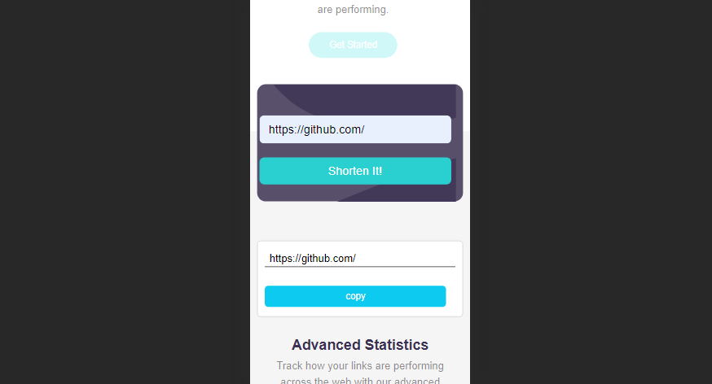

## Table of contents

- [Overview](#overview)
  - [Screenshot](#screenshot)
  - [Links](#links)
- [My process](#my-process)
  - [Built with](#built-with)
  - [What I learned](#what-i-learned)
  - [Continued development](#continued-development)
- [Author](#author)


### Screenshot



The shortened link might not display now cause i am out of clicks.

### Links

- Solution URL: [Add solution URL here](https://your-solution-url.com)
- Live Site URL: [Add live site URL here](https://your-live-site-url.com)

## My process

### Built with

- Semantic HTML5 markup
- CSS custom properties
- Flexbox
- BootStrap 5
- Mobile-first workflow


### What I learned

 1- Got to know how to find solution to CORS issue
 2- How to copy a link to clipboard

To see how you can add code snippets, see below:

```Javascript
const options = {
  mode : 'no-cors',
  then the header follows...
}

 copyLinkButton.addEventListener('click', () => {
            navigator.clipboard.writeText(result.shortUrl)
            copyLinkButton.innerHTML = `Copied!`

            setTimeout(() => {
              copyLinkButton.innerHTML = `Copy`
            }, 1000)
          });
```


### Continued development

I would like to take more projects on API cause it really fun 


## Author

- Frontend Mentor - [@G-best007](https://www.frontendmentor.io/profile/G-best007)
- Twitter - [@G_best007](https://www.twitter.com/g_best007)


